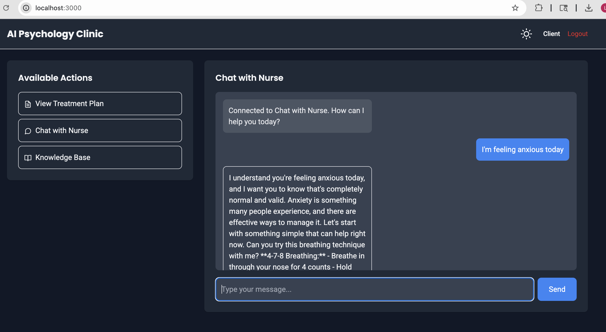
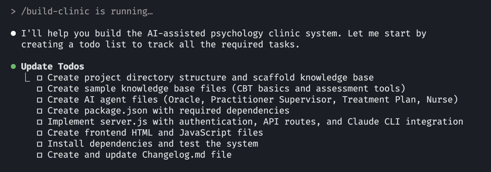

# AI-Assisted Psychology Clinic

**From a single `claude` command, deploy a complete AI-assisted psychotherapy clinic.**


*Professional web interface with role-based dashboards and real-time AI agent chat*

## Prerequisites

Install these tools on your developer machine:

```bash
# 1. Claude Code CLI
curl -fsSL https://claude.ai/install.sh | sh
claude auth login  # Requires Claude subscription

# 2. Bun Runtime  
curl -fsSL https://bun.sh/install | bash

# 3. Verify installation
claude --version && bun --version
```

## Quick Start

```bash
# Deploy complete system
claude /build-clinic

# Start the clinic
bun run serve              # Production mode
bun run test:mock         # Development mode with mock AI responses
bun test                  # Run test suite (13 tests)
```

**Access**: http://localhost:3000
- Admin: `admin` / `admin123`
- Therapist: `therapist` / `therapist123`  
- Client: `client` / `client123`


*The `/build-clinic` command in action - automatically creating the complete system structure*

## System Overview

**4 AI Agents:**
- **Oracle**: Clinical director and quality control
- **Supervisor**: Guidance for therapists
- **Treatment Planner**: Evidence-based treatment plans
- **Nurse**: Client support between sessions

**3 User Roles:**
- **Client**: Chat with nurse, view treatment plans
- **Practitioner**: Create plans, get supervision, manage cases
- **Principal**: Full oversight, reports, administration

**Tech Stack:** Bun + REST API + Vanilla JS + Tailwind CSS + Keyv database

## Knowledge Management

**Lightweight RAG System:** Instead of complex vector databases, the system uses a "poor man's RAG" approach to minimize context usage.

```bash
# Add clinical materials to knowledge_base/
# Process into compact AI-friendly format
claude /distill
```

**How it works:**
- Compresses extensive clinical materials into `distilled/essence.md` (~500-1000 tokens)
- All AI agents automatically reference this single file instead of loading entire knowledge base
- Provides consistent clinical knowledge while minimizing API costs

**Benefits vs Traditional RAG:**
- ✅ Single local file (no vector database)
- ✅ Instant access (no embedding queries) 
- ✅ Fixed small context size
- ✅ No external dependencies
- ✅ Lower API costs

## Testing & Development

```bash
bun test                  # Run 13 test suite
bun run test:mock        # Mock mode (no API calls)
bun run dev              # Hot reload development
```

**Mock Mode:** Provides realistic AI responses without Claude API costs - perfect for development and testing.

## Project Structure

```
clinic/
├── .claude/agents/          # AI agent configurations  
├── knowledge_base/         # Clinical reference materials
├── distilled/             # Compressed AI knowledge
├── images/               # Screenshots and documentation images
├── public/               # Web interface
├── test/                # Test suite  
└── server.js           # Main application
```

## Customization

**Add Clinical Knowledge:**
```bash
# 1. Add materials to knowledge_base/
# 2. Process with distillation
claude /distill
# 3. Restart server
bun run serve
```

**Modify AI Agents:** Edit files in `.claude/agents/` and restart server.

**Extend API:** Add endpoints to `server.js`, update `public/app.js`, add tests.

## Important Notes

- **Professional Use Only**: For licensed mental health professionals
- **AI Supplement**: Agents support but don't replace human clinical judgment  
- **Compliance**: Ensure local healthcare regulations are met
- **Security**: Use secure hosting for healthcare data

---

**Deploy your AI-assisted psychology clinic in minutes!** 🏥